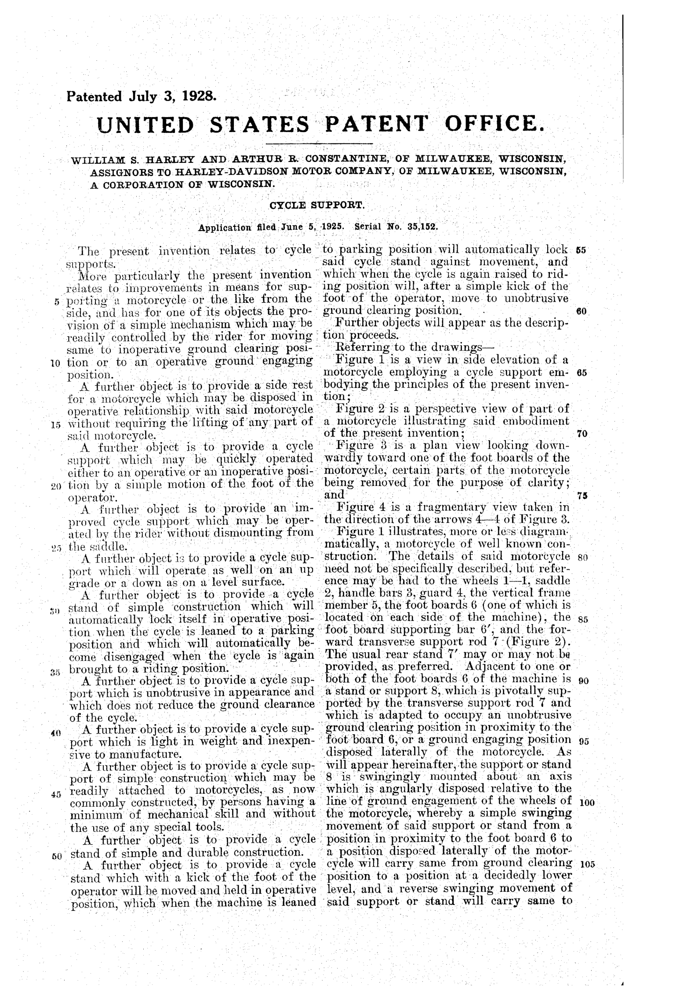

# Cycle Support

- **Category:** OSINT
- **Difficulty:** easy · **Points:** 75
- **Flag:** `trace{1675551}`

> The artifact is a 1928 United States patent, a US Government work in the
> public domain, reproduced here from the original grant document.

## The scenario

A single scanned page, the kind sold framed as wall art. It is dense with
identifiers: a date, two inventors, a company, a title, a filing date, a serial
number. Exactly one identifier has been taken off it, and that is the one the
challenge wants.



## Step 1: Read the page properly

Most of the page is the patent's specification, and none of that matters. The
header is the whole challenge:

```text
Patented July 3, 1928.
UNITED STATES PATENT OFFICE.
WILLIAM S. HARLEY AND ARTHUR R. CONSTANTINE, OF MILWAUKEE, WISCONSIN,
ASSIGNORS TO HARLEY-DAVIDSON MOTOR COMPANY, OF MILWAUKEE, WISCONSIN,
A CORPORATION OF WISCONSIN.
CYCLE SUPPORT.
Application filed June 5, 1925.  Serial No. 35,152.
```

So: William S. Harley, the Harley of Harley-Davidson, and Arthur R. Constantine,
patenting a "cycle support" in 1928. A cycle support is a kickstand. This is the
patent for the motorcycle side stand, and the specification describes it
precisely: a stand the rider flicks down with a foot, which locks when the
machine is leaned over and releases when it is brought upright again.

## Step 2: Notice what is missing

On a granted US patent of this period the **patent number** is printed in the
top-right corner of the first text page, level with the "Patented" line. Look at
that corner: it is blank.

That is the entire puzzle. The page has been stripped of exactly one field, and
it is the field that uniquely identifies the document.

## Step 3: The trap

There *is* a number on the page:

```text
Serial No. 35,152.
```

It is not the answer, and submitting it is the most likely wrong answer this
challenge will receive, which is why the first hint says so outright.

The distinction is worth knowing if you ever work with patent records:

| Number | What it is |
| ------ | ---------- |
| **Application serial number** (`35,152`) | Assigned when the application is *filed*. Namespaced per series, so it repeats across decades, `35,152` alone identifies nothing |
| **Patent number** (`1,675,551`) | Assigned when the patent is *granted*. Globally unique within the series, and what everyone cites |

Three years separate the two events here: filed 5 June 1925, granted 3 July
1928. A patent has both numbers, and only one of them is the patent number.

## Step 4: Look it up

Everything the page *does* carry is indexable. Any of these routes gets there:

- Google Patents, inventor `William S. Harley` + title `Cycle support`
- a plain web search: `Harley Constantine cycle support 1928 patent`
- USPTO search by issue date and assignee
- the serial number `35,152` together with the 1925 filing year

They converge on one record:

```text
US 1,675,551 A — "Cycle support"
Inventors:  William S. Harley, Arthur R. Constantine
Assignee:   Harley-Davidson Motor Company, Inc.
Filed:      5 June 1925        Granted: 3 July 1928
Serial:     US35152A
```

Every field matches the artifact, grant date, filing date, serial number, both
inventors, the assignee and the title. Six independent points of agreement is
what turns a plausible hit into a confirmed one.

## Step 5: Format it

The flag is digits only:

```text
trace{1675551}
```

Not `1,675,551`. Not `US1675551`. Not `US1675551A`. Patent numbers are written
all three ways in the wild, the platform matches one exact string, so the
description states the form and gives a worked example of the shape.

## Why this challenge works

It is a small lesson with a wide application: **identifiers are not
interchangeable**. A document can carry several numbers that look equally
official, and picking the wrong one produces a confident, wrong answer. Anyone
who has chased a case number, an accession number, an MLS number or a docket
number has met the same problem.

It also rewards reading a record for what it *lacks*. The page looks complete,
it takes a moment to realise that a granted patent with no patent number on it
has been edited, and that the edit is the challenge.

## Flag

```text
trace{1675551}
```
