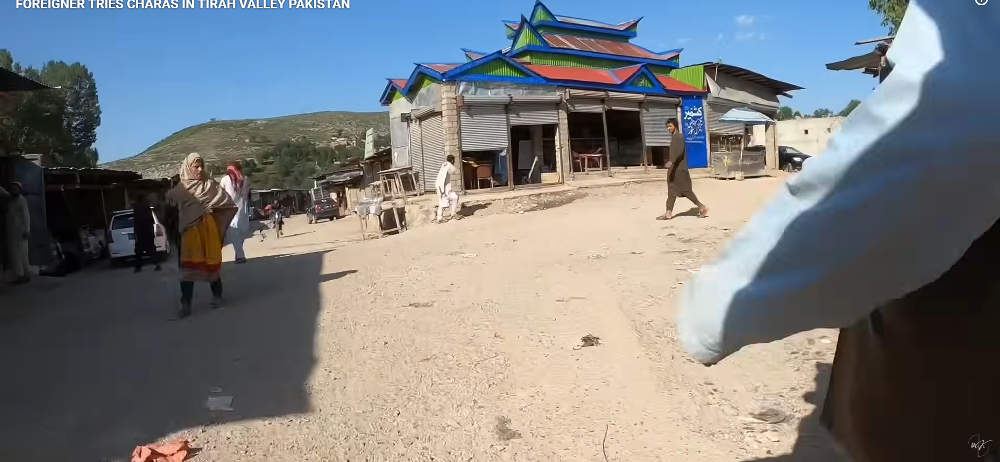

# Drug Market

- **Category:** OSINT
- **Difficulty:** medium · **Points:** 200
- **Flag:** `trace{Tirah_Khyber}`

> **What shipped.** The design called for a third field, a coordinate for the
> bazaar itself, but that pin was never established. The challenge ran on the
> brief's own sanctioned fallback, `trace{Valley_District}`, with "and pin the
> bazaar" removed from the player text. Steps 1 and 2 below are verified and are
> the whole of the live solve path. Step 3 is retained as design notes for
> anyone rebuilding the coordinate variant, not as a path players walked.
>
> One consequence worth noting: at 200 points the challenge was priced for a
> three-step chain ending in a geolocation, and only two of those steps shipped.
> Hint 2, *roofline, not people*, also still points at the geolocation step that
> the fallback flag removed.
>
> **The flag was then cut again, from three fields to two.** It was
> `trace{Tirah_Maidan_Khyber}`; it is now `trace{Tirah_Khyber}`. That removes the
> last discriminating step this challenge had. Distinguishing the basin from the
> valley system was the only part of the answer a player could get wrong after
> reading the title bar, and the answer is now the string already printed across
> the top of the artifact. With hint 3 naming Khyber District outright, both
> fields are obtainable without leaving the image.

## The scenario

One frame from a travel vlog: a dirt street through an open-air bazaar,
somewhere with dry brown hills behind it. The narrator never says where he is
standing. Name the valley and the district.



## Step 1: Read the frame, not the street

Before geolocating anything, read what is written on the image. The still is
burned with the video's own title bar:

```text
FOREIGNER TRIES CHARAS IN TIRAH VALLEY PAKISTAN
```

That is the first hint verbatim, *the frame has a title bar, read it*, and it
hands over the valley in one line. It is a deliberately gentle opening: the
challenge is not about finding the video, it is about what you do once you have
it.

The source is a travel vlog uploaded 2 August 2022:

```text
https://www.youtube.com/watch?v=xuWNqmhjMzA
```

Had the title been cropped away, the fallback chain is reverse image search on
the frame, or searching the visual vocabulary, `tirah charas mandi`, `tirah
maidan bazaar`, which surfaces a cluster of near-identical walkthroughs of the
same market filmed by different creators. That cluster matters later: multiple
camera angles on one bazaar strip is exactly what a geolocation needs.

## Step 2: Place the valley

**Tirah Valley**, Khyber District, Khyber Pakhtunkhwa, Pakistan. A formerly
inaccessible tribal area and long the centre of the country's charas trade,
which is what makes an openly operating bazaar of this kind plausible there and
almost nowhere else nearby.

The bazaar in the frame sits specifically in **Tirah Maidan**, the broad central
bowl of the valley. "Tirah" names the valley system; "Tirah Maidan" names the
basin the market is actually in. **The flag wants the system, not the basin**:
the first field is `Tirah` on its own. See the note on the flag change below,
because this is the one place a careful player can still go wrong.

Read the terrain back against the frame to confirm rather than assume:

| Feature in frame | Reading |
| ---------------- | ------- |
| Treeless brown ridgelines, moderate elevation | Tirah Maidan's bowl inside the wider valley |
| Dry braided ground, no tarmac | Unmetalled bazaar strip |
| Single-storey concrete + corrugated iron shop blocks | Regional vernacular |
| Dress, vehicles, signage in Urdu/Pashto | Khyber Pakhtunkhwa |

This is inconsistent with the Khyber Pass corridor or Bara, which are the two
places a player guessing from "Khyber" alone would land.

The third hint gives the administrative unit, **Khyber District**, for the
second flag field, because district boundaries in the former FATA were redrawn
in 2018 and expecting players to know that is trivia, not skill.

## Step 3: Pin the bazaar (unfinished)

This step is designed but has never been executed, and it is why the challenge
currently ships without coordinates.

The anchor is the roofline, which is what the second hint points at, *roofline,
not people*. The shop block carries a stepped, brightly painted pagoda-style
metal roof in blue, green and red. It is unusual for the region and, critically,
it is the one feature in the frame that should be legible from directly above: a
bright multi-coloured rectangle sitting among dull corrugated roofs.

The intended method:

1. Open Tirah Maidan in Google Earth Pro, at the settlement cluster with the
largest bazaar strip.
2. Turn on historical imagery and step back to 2021 to 2022, matching the
   video's era.
3. Find the painted roof block. Verify with cross-street geometry, the bearing
of the hill line behind it, and the sun angle implied by the shadows in the
video.
4. Corroborate against the other Tirah bazaar walkthroughs from step 1, a
second camera angle on the same block is what turns a candidate into a pin.

Until someone does this, the coordinate field cannot be part of the flag.

## Why this challenge works

The opening is free and the middle is knowledge, but the intended weight sits in
step 3: a single painted roof is the only thing in the frame that survives the
change of viewpoint from street level to overhead. Everything else, the people,
the parked cars, the market stalls, is transient. Geolocation is the discipline
of picking the one feature that will still be there when you look from above,
and the challenge is built entirely around that choice.

## Flag

```text
trace{Tirah_Khyber}
```
