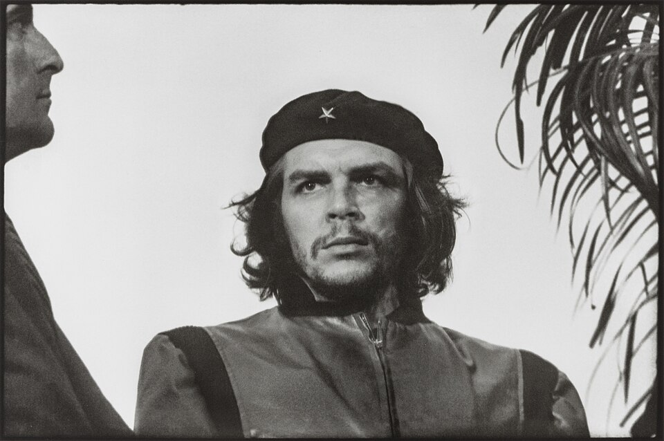

# Everyone Knows the Face

- **Category:** OSINT
- **Difficulty:** medium · **Points:** 100
- **Flag:** `trace{Korda_1960-03-05_Havana}`

> The photograph is actively licensed by the Korda estate. Fine to reproduce in
> a non-commercial writeup with credit; not fine on merchandise or a banner.

## The scenario



One photograph, no caption. The prompt says only that it is the most reproduced
photograph of the twentieth century, that everyone knows the face, and that
almost nobody knows the day.

Name the photographer, the date, and the city.

> **What shipped, versus what was designed.** The brief called for a *tight,
> off-centre crop*, showing little enough of the frame to be unrecognisable at a
> glance. What shipped as `files/beret.jpg` is the **full uncropped negative**,
> with Jorge Masetti's partial profile at the left edge and the palm frond at
> the right.
>
> That is a meaningful softening. The uncropped frame is precisely the version
> Step 1 tells players to go and construct for themselves, so the challenge
> handed over its own first move. Everything below still describes why that move
> matters, because that is the transferable part, but on the shipped artifact
> players got it for free and the challenge played easier than `medium · 100`
> assumes.

## Step 1: Why the crop is cropped

Most players will recognise the source image quickly. Recognising it is not the
problem; **searching** it is.

Run the famous version through any reverse image search and you get a million
merchandise hits, t-shirts, posters, mugs and flags, and essentially no
provenance.
The image is so reproduced that the reproductions bury the original.

The way out is the first hint: *the famous version is cropped, find the
uncropped negative.* The original frame contains two things the poster version
removes:

| In the original frame                                | In the poster |
| ---------------------------------------------------- | ------------- |
| A palm tree on the right                             | cropped out   |
| The partial profile of **Jorge Masetti** on the left | cropped out   |

Those two elements are the search key. A crop that includes the palm or the
second man's profile resolves to archives, museum holdings and articles *about*
the photograph, rather than to a shop. That is a general technique worth
keeping: when an image is too famous to search, search the part of it nobody
reproduces.

On the shipped artifact both elements are already in frame, so hint 1, *the
famous version is cropped, find the uncropped negative*, describes work the
player has been handed rather than work they must do. Dropping the image into a
reverse image search as-is lands on the archives directly.

## Step 2: The photographer

**Alberto Korda**, born Alberto Díaz Gutiérrez, at the time a staff photographer
for the Cuban daily ***Revolución***, which is what the third hint names. He
shot the frame on a Leica M2 with a 90 mm lens.

## Step 3: The event fixes the date

The second hint is the one that does the real work: *he was at a funeral, not a
rally.*

That single correction changes the search. A rally has no fixed date; a memorial
service does, because it is tied to the thing being mourned.

On **4 March 1960**, the French freighter *La Coubre* exploded in Havana harbour
while unloading munitions, killing an estimated 75 to 100 people. The memorial
service was held the following day. Guevara appeared briefly on the platform,
and Korda fired two frames in roughly a second before the subject moved out of
view.

```text
Date:  5 March 1960
City:  Havana, Cuba
Event: La Coubre memorial service
```

## Step 4: Why the day is genuinely hard

Here is the detail that justifies the challenge existing at all.

The photograph **was not published at the time**. *Revolución* did not run it.
It sat in Korda's private collection for seven years, until 1967, when an
Italian publisher obtained copies and it began its career as the most reproduced
image of the century.

So there is no contemporaneous newspaper page to date it from. The date survives
because the *event* is dated and the photograph is attached to the event which
is exactly the chain the hints walk players down.

## Formatting the flag

The photographer has three defensible names, Alberto Korda, Alberto Díaz
Gutiérrez, or just Korda, and the city has two spellings. The flag can only be
one string, so the description names the convention instead of listing
alternates:

> *the surname he is credited under, on its own; the city in its usual English
> spelling*

which resolves to `Korda` and `Havana`, and nothing else.

## Why this challenge works

It inverts the usual difficulty curve. Normally the hard part of an image
challenge is identifying what you are looking at. Here identification is free
everyone knows the face, and every subsequent step is harder than it looks:
searching an over-reproduced image, correcting a wrong assumption about the
occasion, and dating a photograph that nobody published for seven years.

The lesson generalises: fame is not provenance. An image can be on a million
walls and still have almost nothing written about when and where it was made.

## Flag

```text
trace{Korda_1960-03-05_Havana}
```
