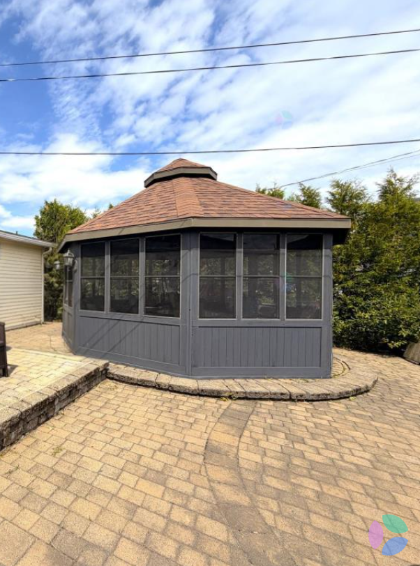
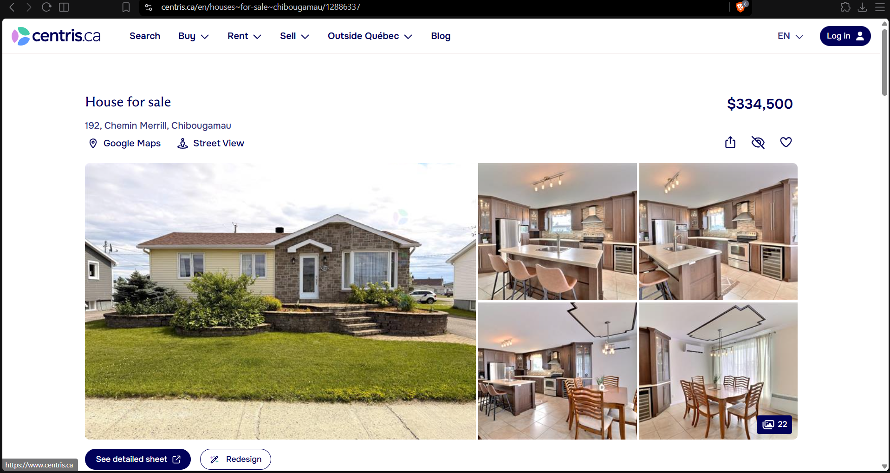
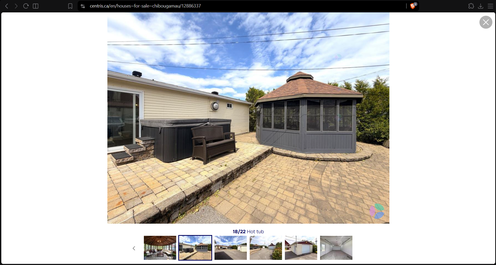
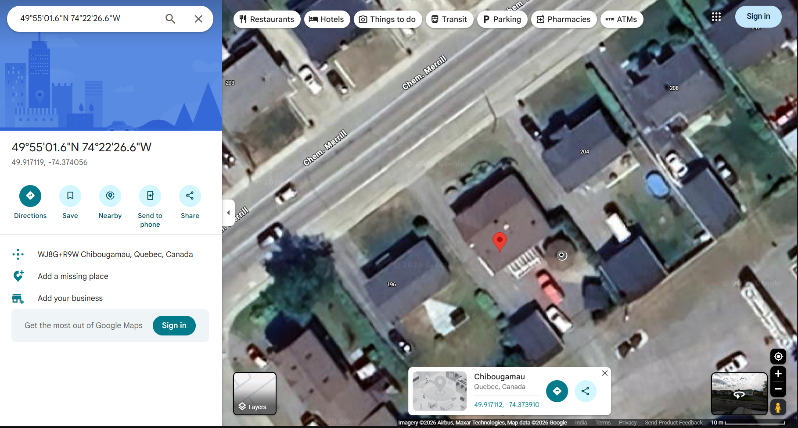

# House Hunting

- **Category:** OSINT
- **Difficulty:** medium · **Points:** 200
- **Flag:** `trace{192_Chemin_Merrill_Chibougamau}`

## The scenario

One photograph of a backyard gazebo. No signage, no house number, no licence
plate, no text anywhere in frame. The task is a complete civic address.



## Step 1: This is not a snapshot

Before searching, read what kind of photograph this is. Wide angle, shot at
midday, the property feature centred and square in frame, everything in focus
from the pavers to the hedge. That is not how people photograph their own
garden. That is how a listing gets photographed.

And in the bottom-right corner sits a small four-colour circle watermark. That
mark belongs to **Centris**, the listing portal run by Quebec's real-estate
boards. The watermark is the entire pivot. The first hint says so outright:
*look at the watermark, not the gazebo*.

Supporting cues put it in Canada rather than the US before the watermark is even
resolved:

| Cue | Reading |
| --- | ------- |
| Screened gazebo, summer-only | Short warm season |
| Steep asphalt shingle roof | Snow load |
| Interlocking paver patio | Built to survive frost heave |
| Overhead distribution lines on wooden poles | North American residential, non-urban |
| Vinyl siding on the neighbouring building | Common Canadian residential cladding |

## Step 2: Find the listing

Reverse image search on the gazebo. **Google Lens is the one that works**;
Yandex tends to drown it in generic gazebo stock, because the subject is a mass
produced structure rather than a landmark. Lens resolves it to a Centris
detached-house listing:

```text
https://www.centris.ca/en/houses~for-sale~chibougamau/12886337
```



The gazebo itself is frame 18 of the listing's 22 photos, shot from the other
side of the patio. Matching it against the artifact is what confirms the listing
is the right one rather than merely a plausible one.



If reverse image search fails entirely, the watermark still carries you: search
`centris chibougamau bungalow gazebo`, or open Centris' map view for Chibougamau
in Nord-du-Québec and sweep the photo galleries by hand. The town has a few
hundred listings at most, a manual sweep is genuinely feasible inside a CTF time
budget, which is what keeps this challenge fair.

## Step 3: Read the address

```text
192, Chemin Merrill
Chibougamau, Nord-du-Québec, G8P1C9
Bungalow · 3 bedrooms · 2 bathrooms
MLS 12886337
```

Only the address fields matter, and only they are stable, see the note on
listing metadata below before quoting a price or an agent anywhere.

Centris prints a comma after the civic number. The flag does not use it,
`192_Chemin_Merrill_Chibougamau`, and the description says so, because
punctuation should never be the thing that costs a team a solve.

## Step 4: Confirm before submitting

Drop `192 Chemin Merrill, Chibougamau` into Google Maps or OpenStreetMap and
switch to satellite. The octagonal gazebo is visible in the backyard, sitting on
its paver patio, with the hedge line running behind it and the beige-sided
neighbouring building on the correct side. That is the confirmation step: the
listing told you the address, and the satellite view proves the photo belongs to
it.



## A note on the second hint

The shipped hint 2 reads, in full:

```text
Not the MLS you are thinking of. Go Maple.
```

"Go Maple" is a nudge toward *Canada*, the maple leaf, and "not the MLS you are
thinking of" steers off the US-centric MLS portals a player defaults to.
Together they aim at Centris, on the implied premise that this listing lives on
a Quebec portal rather than the national one.

**As of 2026-08-16 that premise does not hold for this property.** The same
listing, under the same MLS number **12886337**, is published on REALTOR.ca the
national portal and the page title carries the address outright:

```text
https://www.realtor.ca/real-estate/30097931/192-ch-merrill-chibougamau
"For sale: 192 Ch. Merrill, Chibougamau, Quebec G8P1C9 - 12886337"
```

A player who ignores the hint and goes to REALTOR.ca lands on the correct
address immediately. So the challenge stays solvable either way, but the hint
costs 50 points to steer players *away* from a portal that would have answered
them, which is the wrong shape for a paid hint. Point it at the watermark
instead, or drop it.

## Flag

```text
trace{192_Chemin_Merrill_Chibougamau}
```
