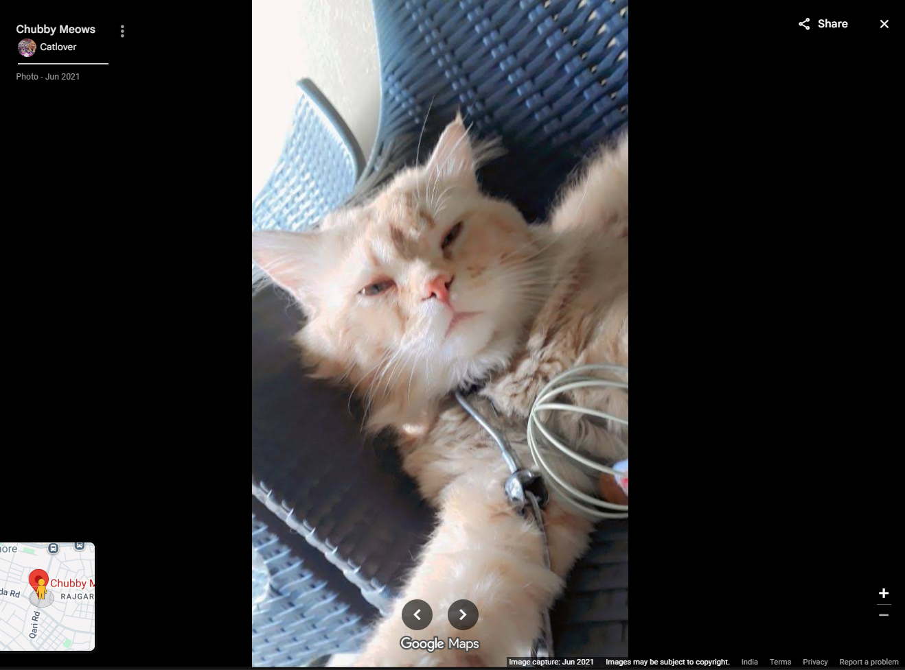
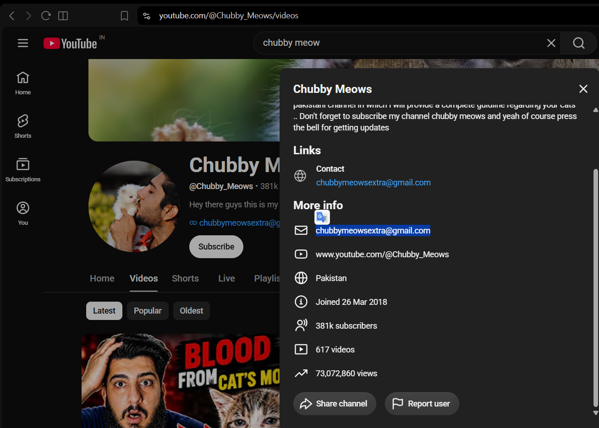
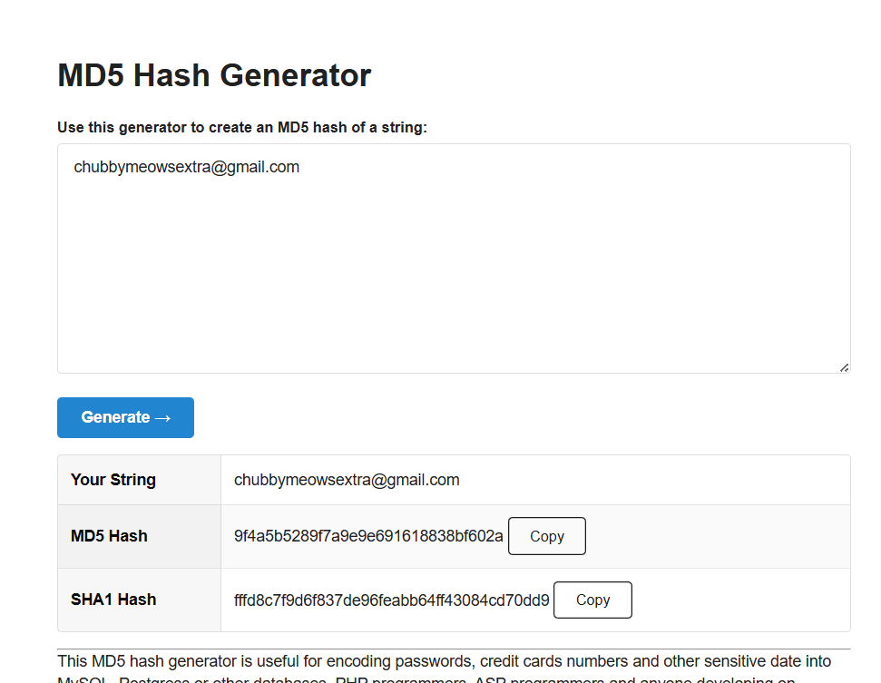

# I Love Cats

- **Category:** OSINT
- **Difficulty:** easy · **Points:** 50
- **Flag:** `trace{9f4a5b5289f7a9e9e691618838bf602a}`

> This challenge pivots through a real, live business listing and YouTube
> channel. Everything used is material the owner published themselves.

## The scenario

Players get one screenshot: a cream Persian/Maine-Coon-looking cat asleep on a
blue rattan chair. The task is to find the public contact address the cat's
people hand out, and submit its MD5.

The cat is bait. The screenshot is the challenge.



## Step 1: It's a place photo, not a pet photo

The artifact is not a bare photograph. It is a screenshot of the **Google Maps
photo viewer**, shipped with all its chrome intact, and the chrome is the
challenge:

| Tell | What it gives you |
| ---- | ----------------- |
| Panel title | **Chubby Meows**, the business name, top-left |
| Contributor row | `Catlover`, the uploader |
| `Photo - Jun 2021` | when it was contributed |
| `Google Maps` watermark + `Image capture: Jun 2021` | confirms the surface |
| `India / Terms / Privacy` strip | the locale the viewer was loaded from |
| **Mini-map, bottom-left** | the street grid |

That mini-map is the part worth slowing down on. It leaks `Qari Rd`, a road
ending in `...da Rd`, the label `RAJGAR...`, and a truncated `...hore` at the
top edge. Expand the abbreviations against the business name and you get:

**Chubby Meows, Qari Road, Rajgarh, Lahore, Pakistan.**

Note the `India` in the footer strip is the *viewer's* locale, not the subject's
country, a small trap for anyone who reads it as a location claim.

If the panel had been cropped away, reverse image search (Lens / Yandex) on the
cat alone still lands on the Chubby Meows listing and its social reposts. The
chrome makes it fast, not possible.

## Step 2: Business to channel

Searching `Chubby Meows` returns a pet clinic / pet-supplies business in Lahore
, 84 Qari Road, Rajgarh, with a second branch at 55-B Main Blvd, Johar Town,
and, more usefully, a YouTube channel:

```text
youtube.com/@Chubby_Meows   •   381k subscribers   •   Joined 26 Mar 2018   •   Pakistan
```

The second hint, *"They also do video,"* points here. 381k subscribers is a much
louder surface than a Maps listing, and channels publish a contact block that
businesses often forget is public.

## Step 3: The About panel

Open the channel, then **About** / *More info*. The contact block hands the
address over directly:



```text
Contact:  chubbymeowsextra@gmail.com
```

**Read that address, don't guess it.** The `extra` is the entire difficulty of
the challenge. `chubbymeows@gmail.com` is the obvious guess, it is wrong, and it
hashes to something completely different. A player who assumes the address from
the channel handle never gets a hit and has no feedback explaining why.

## Step 4: Hash it correctly

```bash
printf '%s' 'chubbymeowsextra@gmail.com' | md5sum
# 9f4a5b5289f7a9e9e691618838bf602a
```



The `printf '%s'` is not a stylistic detail. `echo` appends a trailing newline,
so `echo 'chubbymeowsextra@gmail.com' | md5sum` hashes 27 bytes instead of 26
and returns `29f8bca4cad845d905dd159b8cd979a9`. That is the single most common
wrong submission on a challenge of this shape, which is why the description
states *"no trailing newline"* explicitly rather than leaving players to
discover it by burning attempts.

| Submission | MD5 | Why |
| ---------- | --- | --- |
| `chubbymeowsextra@gmail.com` | **9f4a5b5289f7a9e9e691618838bf602a** | correct |
| same, trailing `\n` (via `echo`) | `29f8bca4cad845d905dd159b8cd979a9` | newline not stripped |
| `chubbymeows@gmail.com` | `392c981cab7532b9717b424bf14092b1` | guessed instead of read |

## Why this challenge works

The pivot chain is short, place photo, listing, channel, contact block, and
every link runs through material the subject chose to publish. There is nothing
to break into and nothing private in the path. What it teaches is that a single
photo uploaded to a business listing carries the business, its street, its city
and its whole public presence along with it.

The sting is in the last two steps. Both failure modes are the same mistake in
different clothes: substituting what you assume for what the source actually
says. Guessing the address instead of reading it, and hashing a string you
didn't check the bytes of.

## Flag

```text
trace{9f4a5b5289f7a9e9e691618838bf602a}
```
