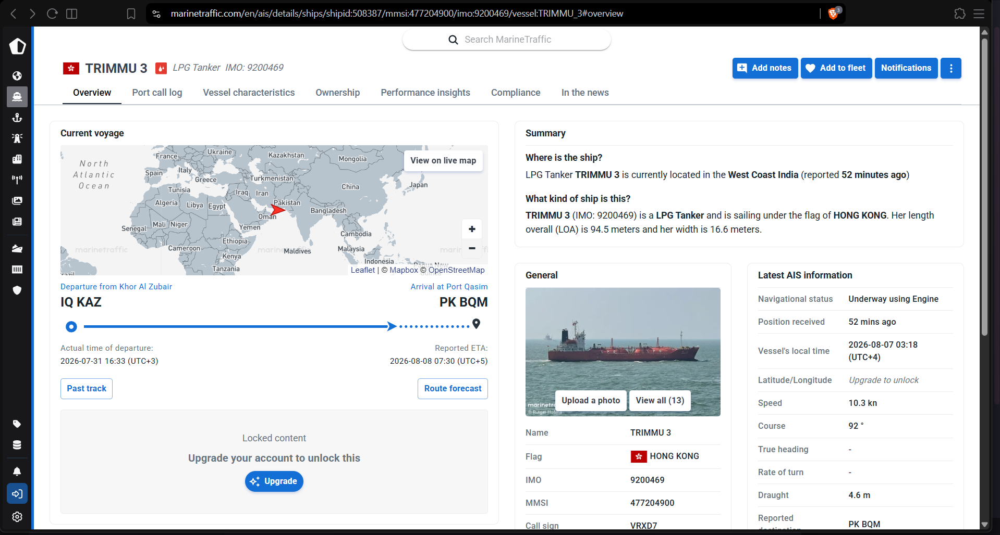

# Lost at Sea

- **Category:** OSINT (chained: OSINT / Crypto / Web-forensics / Stego)
- **Difficulty:** hard · **Points:** 500
- **Flag:** `trace{TR1MMU_3_SUCCE55_051NT}`

## The scenario

Five files. A screenshot from a coordinator's terminal, a coastal monitoring
station's log from the same night, and three documents a port authority was
still serving after it pulled the paperwork.

Four phases, each one gated on a value read in the phase before it.



## Phase 1: Everything except the one thing you want

The dashboard is generous:

```text
Vessel:        TRIMMU 3      LPG Tanker
IMO:           9200469       MMSI: 477204900      Call sign: VRXD7
Flag:          Hong Kong     LOA 94.5 m × 16.6 m  Draught 4.6 m
Voyage:        IQ KAZ (Khor Al Zubair) → PK BQM (Port Qasim)
ATD:           2026-07-31 16:33 (UTC+3)     ETA: 2026-08-08 07:30 (UTC+5)
Nav status:    Underway using Engine
Local time:    2026-08-07 03:18 (UTC+4)
Speed/Course:  10.3 kn / 92°
Lat/Long:      *** Upgrade to unlock ***
```

Name, IMO, MMSI, call sign, flag state, dimensions, both ports, departure, ETA,
speed, course, and one field behind a paywall.

**The paywall is bait.** Chasing it is the most expensive mistake available
here, and the first hint exists to stop you: nothing downstream needs the
position. Three values do the work: the **MMSI**, the **speed**, and the **call
sign**.

That is a lesson in itself. A locked field is conspicuous, and conspicuous is
not the same as important. The interesting material on this screen is the
material nobody bothered to hide.

## Phase 2: The key is on the dashboard

`radio_intercept.txt` reads like a monitoring log, because that is what it is
pretending to be. Two things matter in it.

A base64 blob:

```text
--- BEGIN TRANSMISSION ---
<600 characters of base64>
--- END TRANSMISSION ---
```

And, a few lines later, the station saying the quiet part out loud:

```text
"KEY = MMSI_SOG"
"MMSI as printed. SOG in knots, one decimal. Underscore between."
"AES-256-CBC. Key is the SHA-256 of that string. IV is the first sixteen
 bytes. Base64 above."
```

The method is given away completely; only the key is withheld. That is
deliberate. A crypto phase should test whether you have the key material, not
whether you can guess how the organizer spelled a string. The key is
`477204900_10.3`.

```bash
python - <<'EOF'
import base64, hashlib
from Crypto.Cipher import AES
log = open('radio_intercept.txt').read()
b64 = "".join(log.split('--- BEGIN TRANSMISSION ---')[1]
                 .split('--- END TRANSMISSION ---')[0].split())
raw = base64.b64decode(b64)
key = hashlib.sha256(b"477204900_10.3").digest()
pt = AES.new(key, AES.MODE_CBC, raw[:16]).decrypt(raw[16:])
print(pt[:-pt[-1]].decode())
EOF
```

CyberChef does the same in two operations: *From Base64*, then *AES Decrypt*
with the key as SHA-256 of the key string and the IV taken from the first 16
bytes.

## Phase 3: A 404 is a response

Most people expect the plaintext to be a URL. It is not. It is a **captured HTTP
response**, and it is a 404:

```text
HTTP/1.1 404 Not Found
Date: Fri, 07 Aug 2026 04:18:22 GMT
Server: nginx/1.24.0
Content-Type: text/html; charset=utf-8
Content-Length: 137
X-Cargo-Manifest: /static/img/trimmu3.png
X-Archive-Note: manifest withdrawn from index 2026-08-07; asset retained
Connection: close

<!doctype html>
<html><head><title>404 Not Found</title></head>
<body><h1>404 Not Found</h1><p>No manifest at this path.</p></body></html>
```

Read the body and you learn nothing: the manifest is gone. Read the **headers**
and the server tells you it kept the asset and where it put it.

That is the phase, and the third hint states it outright: *a 404 is a response,
and responses have headers.* A status code is a summary, not the message. People
throw away 404s without looking at what came with them, and servers leak more in
headers than anybody audits, `X-` headers especially, because they are usually
added by an application developer rather than by the platform.

Three images ship. The header picks one:

| File | Size | `IEND` at | `PK\x03\x04` at | Bytes after `IEND` | Role |
| ---- | ---: | --------: | --------------: | -----------------: | ---- |
| `trimmu3.png` | 21,517 | 21,093 | **21,101** | **416** | named by the header, the carrier |
| `kaz_berth.png` | 16,974 | 16,966 | n/a | 0 | decoy |
| `bqm_approach.png` | 17,303 | 17,295 | n/a | 0 | decoy |

The decoys are byte-clean: their files end at `IEND`, with nothing appended. So
a player who skips the header and brute-forces all three with `binwalk` still
lands on `trimmu3.png`. The header saves time rather than being the only way
through. It also means artifact integrity is checkable at a glance: any trailing
bytes on the decoys would be a packaging error.

## Phase 4: The manifest

`trimmu3.png` opens perfectly well as an image. It is also an archive.

PNG decoders stop at the `IEND` chunk and ignore whatever follows, so a zip can
be appended to a valid PNG and the file stays a valid PNG. Anything that scans
for `PK\x03\x04` finds the archive:

```bash
binwalk trimmu3.png          # or: strings, or a hex editor, or `file`
unzip -P VRXD7 trimmu3.png
cat manifest.txt
```

The password is the **call sign**. That is what the fourth hint means by *every
port has a call sign*, and it is a value that has been sitting on the dashboard
since Phase 1.

That closes the loop: the first artifact contained the key to the last one.

```text
PORT QASIM AUTHORITY -- CARGO MANIFEST (WITHDRAWN COPY)
Vessel      : TRIMMU 3   IMO 9200469   MMSI 477204900
Voyage      : IQ KAZ -> PK BQM
Transfer    : ship-to-ship, position withheld from filed copy
Filed       : 2026-08-07
Status      : withdrawn from public index

Declared cargo differs from the filed copy. Reconciliation reference:

trace{TR1MMU_3_SUCCE55_051NT}
```

## Why this challenge works

Each phase is gated on a value read in the phase before, and all three values
come off a single screenshot. The dashboard is not scenery. It is the key
material for the entire chain, handed over in the first thirty seconds and only
useful once you know what each field unlocks.

Underneath, the same idea shows up three times in three different costumes:

- The **paywalled coordinate** looks like the secret and is not.
- The **404 body** looks like the whole response and is not.
- The **PNG** looks like the whole file and is not.

Each time, the thing worth having is sitting next to the thing you were looking
at, unprotected, because nobody thought of it as content.

## Flag

```text
trace{TR1MMU_3_SUCCE55_051NT}
```
