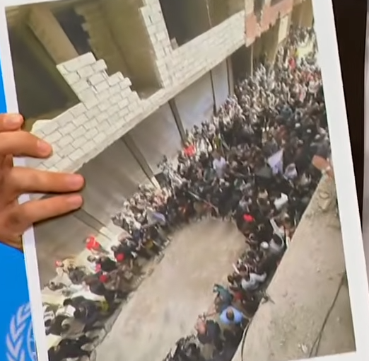
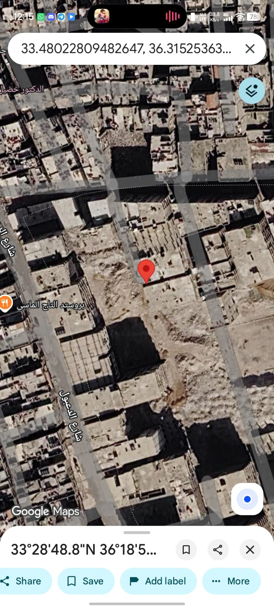
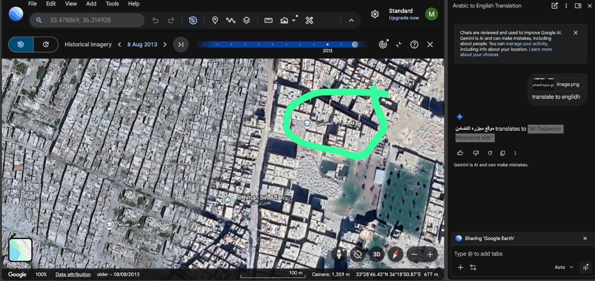
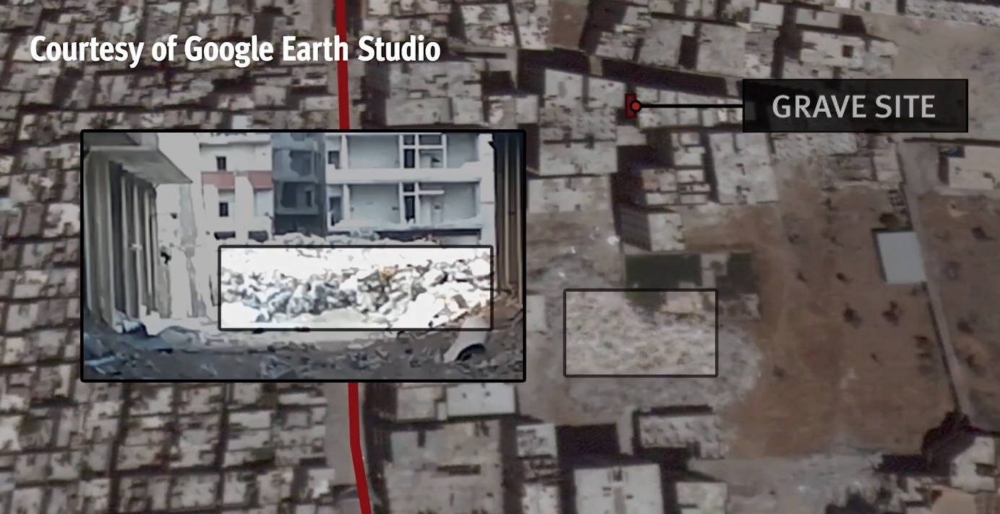

# Massacar

- **Category:** OSINT
- **Difficulty:** insane · **Points:** 800
- **Flag:** `trace{33.480228, 36.315253}`

> **Content note.** This challenge concerns the Tadamon massacre of 16 April
> 2013, in which members of the Syrian Military Intelligence Directorate
> (Branch 227) murdered dozens of civilians and burned their bodies in a pit.
> The site is real, the victims were real, and the photograph in the artifact
> shows people who came to it once the area became accessible. Read the
> sources
> at the end.

## A note from the organizers

This challenge asked for a point on the ground to six decimal places, and we
know that the last step, turning a correct identification into an accepted
string, was harder and less forgiving than it should have been. Several teams
did the real work: they found the stakeout, read the photograph, recognised
Tadamon, and arrived at the right street and the right site. Landing the exact
coordinate after that was a different and much narrower test than the one we
meant to set.

Some of the difficulty was genuinely in the material. The published record on
this site is unusually good on *what* and *where in words*, and unusually thin
on *coordinates*: the major investigations name the neighbourhood, the street
and the mosque, and print no numbers at all. A player following the best sources
lands on a description, not a decimal. We picked a flag format that did not
account for that.

We are not going to dress this up: the ambiguity was ours, not the players'. Our
thanks to the teams who worked it patiently and to those who wrote in about it
rather than walking away from the challenge.

For future events we are committing to the following on any
geolocation-to-coordinate challenge:

1. **State the tolerance, or do not ask for coordinates.** If the platform
cannot accept a radius, the answer will be a place name, a street, or a
landmark, not a decimal string.
2. **Pin the format by example, not by description.** A worked sample in the
challenge text, showing spacing and decimal places exactly, instead of a
sentence describing them.
3. **Check that a reachable source actually publishes the answer.** If the
intended research path ends in words, the flag will be those words.
4. **Say when sources disagree.** Where reputable sources carry conflicting
points for the same site, the challenge will name which one it wants.

The investigation this challenge points at is worth doing regardless of how the
scoring went, and the sources at the end are the reason we set it.

## The scenario

A still from a UN Security Council stakeout. A delegate holds a printed
photograph up to the cameras, an overhead shot of a crowd packed into a narrow
street between shelled buildings. Nobody reads out where it was taken.

Find the alley.



## Step 1: Identify the stakeout

The blue backdrop and the sliver of emblem at the left edge are the only context
in the frame, and they are enough: this is a UN stakeout, filmed against the
standard press backdrop. That makes it indexed, dated and findable, which is
what the first hint means by *the stakeout is dated, start there*.

```text
Syria on the situation in the country — Security Council Stakeout (24 April 2026)
https://www.youtube.com/watch?v=wbfI1vyLPBs
```

UN WebTV and the UN YouTube channel both carry the session. Scrub to the moment
the speaker raises the photograph and pull a clean frame, the shipped artifact
is a phone-quality still of a printed page, so the video gives a better one to
work from.

## Step 2: Read the photograph, not the room

What is in the held-up print:

- an overhead shot looking down a narrow street, taken from an upper floor
- shelled, unfinished concrete buildings on both sides
- a crowd filling the street shoulder to shoulder
- a bare dirt cut running across the foreground
- a raw breeze-block wall on the left, an unfinished pilotis frame on the right

The crowd is the misdirection. This is not a protest and not a rally. It is
people gathered at a place, in numbers, once that place became reachable. The
geolocatable content is the architecture around them: the taper of the alley,
the wall, the rubble lot, the pillared frame.

## Step 3: Recognise the site

Those features belong to a street in **Tadamon**, south-eastern Damascus, and to
one of the most heavily documented atrocity sites of the Syrian war.

On 16 April 2013, members of the Syrian Military Intelligence Directorate
(Branch 227) executed civilians at a pit dug in the street and burned the
bodies. It became public years later, when leaked footage was obtained and
analysed by **Annsar Shahhoud** and **Prof. Uğur Ümit Üngör** of the NIOD
Institute for War, Holocaust and Genocide Studies, and published through The
Guardian and New Lines. After the fall of the Assad government, **Human Rights
Watch** reached the site in person in December 2024 and called for it to be
preserved and investigated.

The second hint, *investigative journalists already did the geolocation*, is the
intended shortcut. This is not a site a player should be expected to pin from
scratch; it is a site where the open-source investigation community has already
done the work and published it, and the skill being tested is finding and
reading that work.

## Step 4: Follow the published record

| Field | Value |
| ----- | ----- |
| City | Damascus, Syria |
| Neighbourhood | Tadamon (south-eastern sector) |
| Street | Daaboul Street (شارع دعبول) |
| Micro-site | Alleyway / dirt pit by the Othman bin Affan Mosque (مسجد عثمان بن عفان) |

The third hint names the mosque, because the mosque is the fixed landmark. New
Lines states the researchers' own confirmation plainly, *"the experts provided
conclusive evidence, based on the nine pillars of the building next to the pit,
that confirmed our assumption that the massacres indeed took place near the
Othman Mosque in Tadamon."*

That detail is worth dwelling on, because it is the same technique the challenge
asks for: nine pillars in a photograph, counted and matched against a building
that still stands. The unfinished pilotis frame visible on the right of the
held-up photo is the same structural vocabulary.

Note the source says *near* the mosque. Earlier drafts of this challenge's notes
said *opposite* it, which is tighter than the published wording supports, see
the caution at the end.

The perpetrators chose the alley because in 2013 it sat directly on the
frontline between regime-held Tadamon and opposition-held Yarmouk, destroyed,
uninhabited, unobserved.

## Step 5: Pin it

```text
33.480228, 36.315253
```

Equivalent to **33°28′48.8″N 36°18′54.9″E**.

The pin is confirmable in Google Maps, where the site carries a crowd-sourced
POI named **موقع مجزرة التضامن** ("Al-Tadamon Massacre site"):



Google Earth's historical imagery is the right tool for the second pass, because
the 2013 layer shows the block as it was at the time rather than after the later
clearance. The same POI is visible there, with the Othman bin Affan mosque pin
to its south-west:



Measuring the circled POI off that desktop frame, pixel offsets from the camera
readout, scaled by the frame's 100 m bar, puts it within roughly 30 m of the
mobile pin. Two independent captures of the same object, and they agree.

## Step 6: Corroborate with Human Rights Watch

The strongest confirmation postdates the New Lines investigation and is the
reason to trust this pin over the alternatives below.

After the fall of the Assad government, HRW visited Tadamon on **11 to 12
December 2024** and published *Syria: Mass Grave in Damascus Should be
Protected, Investigated* (16 December 2024), with an accompanying video,
*Damascus Mass Grave Needs to be Preserved and Investigated*, that marks the
location with a **GRAVE SITE** callout over Google Earth Studio imagery.



What HRW establishes:

- **It is the same site, not a nearby one.** HRW retraced "the final moments of
the 11 blindfolded victims shown in the video who were all shot at close range
and pushed into the machine-dug grave", the April 2013 footage, the same ground.
- **The geolocation is photogrammetric and then physical.** HRW built a 3D model
from the leaked video and matched it to terrain, then went to the site and found
human remains. That is a stronger method than anything else in the chain.
- **The site is a machine-dug grave in an open cut**, in an area of destruction
HRW puts at "at least one square kilometer", which is what the dropped pin above
is sitting on.

HRW publishes **no coordinates**; the video marker is its only spatial output,
and its position in the frame is consistent with this pin. That is the crux of
the difficulty discussed in the organizers' note: the best source in the chain
confirms the place without ever printing the number the flag wanted.

## A caution on the coordinate

The flag is well supported, but two other points for this event are in
circulation and a player may reasonably land on either.

| Source | Coordinate | Decimal | Offset from flag |
| ------ | ---------- | ------- | ---------------: |
| **The flag** | 33°28′48.8″N 36°18′54.9″E | `33.480228, 36.315253` | n/a |
| Wikidata `Q111752851` and its wiki mirrors | 33°29′08″N 36°19′06″E | `33.48556, 36.31833` | **659 m** on bearing 026° |
| This challenge's own design notes | 33°28′40″N 36°18′34″E | `33.47778, 36.30944` | **605 m** on bearing 243° |

**On Wikidata.** The English Wikipedia article prints no coordinate at all, so
it places the site narratively, "in the vicinity of the Othman Mosque" on
Daaboul Street, so the structured figure does not have the article behind it. It
is the machine-readable source a careful player will reach for precisely because
the flag wants many decimal places, and it is 659 m out.

**On the design-notes figure.** `33.47778, 36.30944` (5 dp, no space) appears in
this challenge's working notes and in earlier revisions of this writeup, and for
a period it was wrongly recorded as the flag in `challenge.json`. **It was never
the flag the event ran with.** It sits 605 m south-west of the site and does not
match the Google POI or HRW's location. It has been corrected in
`challenge.json` as of version 1.1.0; if it appears in any other organizer
material, that material is stale.

**On the landmark wording.** In Google's own data the massacre POI is roughly
170 m from the Othman bin Affan mosque pin, near it, in the sense New Lines
uses, but not across the street from it. A team reasoning from *opposite the
mosque* to a pin would land short.

**On decimal forms in circulation.** Secondary sources that quote a decimal for
this event give truncated four-place figures inherited from the older working
coordinate. None of them extends to the flag, and none should be treated as the
answer.

## Sources

- New Lines, *How a Massacre of Nearly 300 in Syria Was Revealed*,
<https://newlinesmag.com/reportage/how-a-massacre-of-nearly-300-in-syria-was-revealed/>
- Amnesty International UK, *Tadamon massacre: six minutes that shocked a
  nation*,
<https://www.amnesty.org.uk/latest/tadamon-massacre-six-minutes-shocked-nation/>
- Human Rights Watch, *Syria: Mass Grave in Damascus Should be Protected,
Investigated* (16 December 2024),
<https://www.hrw.org/news/2024/12/16/syria-mass-grave-damascus-should-be-protected-investigated>
- Human Rights Watch, *Damascus Mass Grave Needs to be Preserved and
Investigated* (video; GRAVE SITE marker over Google Earth Studio imagery,
~4:18), <https://youtu.be/cgJNDkvUeWE>
- Wikidata item `Q111752851`, carried for the competing coordinate only.

## Flag

```text
trace{33.480228, 36.315253}
```
