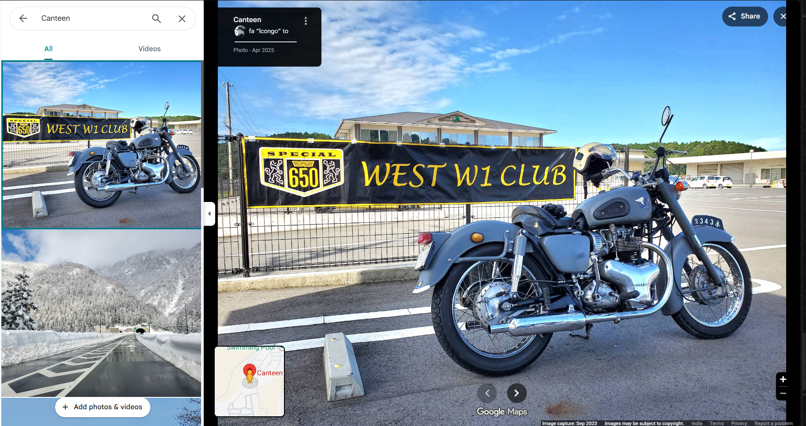

# Nuclear

- **Category:** OSINT
- **Difficulty:** medium · **Points:** 175
- **Flag:** `trace{24.8548,66.7690}`

> Everything used here is public: the pin, the photo and the complex's
> coordinates are all published on Google Maps and Wikipedia. The challenge is
> pointed at *the misfiled photo*, not at the facility. The lesson is "audit
> your own OSINT footprint".

## The scenario

One screenshot. A vintage grey Kawasaki parked in front of a motorcycle club
banner, on a sunny day, in what is very obviously Japan. The question asks for
the precise location of a **staff canteen inside a nuclear power complex in a
SAARC country**.

The photo and the question do not match. That mismatch is the challenge.



## Step 1: Resist the bike

Everything in the photograph pulls toward Japan, and all of it is a dead end:

| Visible | Reading |
| ------- | ------- |
| Kawasaki W1, `650 SPECIAL` shield | Japanese classic, 1965 to 1974 |
| `WEST W1 CLUB` banner | A Japanese owners' club |
| Hipped-roof clubhouse, low-rise | Japanese roadside/community building |
| White-on-green plates, kei vans | Japanese registration |
| Second gallery thumbnail: snow-walled mountain road | Japanese alpine route |

A player who starts reverse-image searching the motorcycle spends the entire
window in Kansai and finds nothing, because the bike genuinely is in Japan. The
first hint exists to break exactly this: *the photo is a lie, the pin is the
truth*.

## Step 2: Read the chrome, not the picture

The artifact is not a photograph. It is a screenshot of the **Google Maps place
photo viewer**, and the interface around the image is the evidence:

- **Panel header:** `Canteen`, the place this photo was uploaded to
- **Contributor line:** `fa "Icongo" to`, the uploader
- **`Photo - Apr 2025`** with **`Image capture: Sep 2023`**, uploaded well after
  it was taken
- **Left rail:** the place's other gallery images
- **Mini-map, bottom-left:** the `Canteen` pin, next to a `Swimming Pool`

A Japanese motorcycle meet is sitting in the photo gallery of a place called
"Canteen". Someone uploaded a holiday photo to the wrong pin, probably from a
contributions list, probably without looking. The picture is in Japan. The
*place* is not.

## Step 3: Pivot to the place

Two routes, both public:

**Contributor pivot.** Open the uploader's Maps contributions from the photo
panel. Their photo set mixes Japanese road shots with this one misfiled upload,
and the `Canteen` entry links straight through to the place page. This is what
the second hint means by *contributor profiles are public*.

**Place pivot.** Search Maps for the place name and constrain it with what the
challenge already told you: a nuclear power complex in a SAARC member state.
Enumerate the coastal ones:

| SAARC state | Coastal reactor complex |
| ----------- | ----------------------- |
| India | several |
| **Pakistan** | **KANUPP / Karachi Nuclear Power Complex**, Paradise Point |
| all others | none |

KANUPP sits about 25 km west of Karachi city centre: K-1 was decommissioned in
2021, K-2 online 2021, K-3 online 2022. The `Canteen` pin is inside the KANUPP
colony, alongside the swimming pool the mini-map shows.

## Step 4: Read the coordinates off the URL

The place page URL carries the location twice, and the two values are not the
same thing:

```text
https://www.google.com/maps/place/Canteen/@24.8546632,66.7689546,3a,75y/...!8m2!3d24.854835!4d66.76895!...
                                          └──── camera position ────┘        └──── the pin ────┘
```

The `@` pair is wherever the viewport happened to be sitting. The `!3d...!4d...`
pair is the place itself:

```text
lat 24.854835   long 66.768950
```

Cross-check against the published complex coordinates, 24°50′55″N 66°46′55″E
(24.84861, 66.78194), the figure Wikipedia carries for the Karachi Nuclear Power
Complex. Measured against the pin:


```text
reactor (24.84861, 66.78194) -> canteen (24.854835, 66.768950)
  1,482 m on bearing 298°  (west-north-west)
```

So the canteen sits about **1.5 km WNW of the reactor coordinate**, within the
KANUPP reservation at Paradise Point and alongside the swimming pool the
mini-map shows. That separation is the confirmation, not a problem with it:
reactor buildings and staff amenities are deliberately a walk apart, and a
canteen adjacent to a pool reads as the residential colony rather than the plant
island. A pin that landed *on* the reactor would be the suspicious result.

Rounded to four decimals: **24.8548, 66.7690**.

## Mind the rounding

Four decimal places sounds unambiguous. It is not, and it is worth knowing which
tool you used:

| Method | Result |
| ------ | ------ |
| `printf '%.4f'` | `24.8548,66.7690` ✅ |
| `Decimal(...).quantize(ROUND_HALF_UP)` | `24.8548,66.7690` ✅ |
| Python `round(66.76895, 4)` | `66.769`, trailing zero dropped |
| Truncation | `66.7689` |
| Using the `@` camera position | `24.8547,66.7690` |

The description therefore asks for *exactly 4 decimal places, keep trailing
zeros*. Read the pin, format it, don't let a language's rounding function decide
your flag for you.

## Why this challenge works

Most geolocation challenges ask "where was this photograph taken". This one asks
the opposite question, *where does this photograph claim to be*, and the two
answers are 6,000 km apart. The skill it trains is noticing that user-generated
content carries a container as well as content, and that the container is often
the part that leaks. A single careless upload attaches a holiday snapshot to a
named facility, permanently and publicly.

## Flag

```text
trace{24.8548,66.7690}
```
