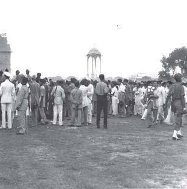

# One Photograph

- **Category:** OSINT
- **Difficulty:** medium · **Points:** 150
- **Flag:** `trace{Princess_Park_1947-08-15}`

> The photograph is a 1947 press/archival image of uncertain authorship,
> redistributed by the Flag Foundation of India. Reproduced with credit for a
> non-commercial CTF.

## The scenario

Players get one file and four lines of text. No caption, no EXIF, no filename to
pivot on, nothing written in frame. The task is to name the place and the date.

A black-and-white scanned print: a crowd of men stands about on open grass in
flat daylight, white kurta-pyjama, Gandhi caps, several uniformed figures in
peaked caps and khaki shorts, one holding a bicycle. A **domed chhatri on
slender pillars** sits in the middle distance, centre frame. Trees line the
right edge. At the far-left margin, the dark corner of a much larger arched
structure is just cut off by the crop.

That crop is the design. It removes almost all of the monument on the left,
leaving the canopy as the primary landmark, enough to identify the location, not
enough to hand it over on sight.



## Recon

The usual first moves all come up empty, and that is intentional:

```sh
$ exiftool photo.jpg
File Type      : JPEG
Image Size     : 311x314
# no EXIF, no GPS, no timestamps, no camera make

$ strings photo.jpg | head
JFIF
```

There is no metadata layer to this challenge. Everything must come out of the
pixels.

## The search

Run the file through reverse image search. All four majors are worth trying, but
they are not equivalent here:

| Engine | Behaviour on this image |
| ------ | ----------------------- |
| Google Lens | Strong on modern photos, weaker on low-res pre-1950 scans |
| **Yandex** | **Materially better on old scanned prints, most likely to return the original** |
| TinEye | Exact-copy matching; good if the reposted file is unmodified |
| Bing Visual Search | Occasionally surfaces the reposts Lens misses |

The image resolves to a widely reposted archival photograph of the first public
flag-hoisting ceremony of independent India, and to the post that carries the
answer verbatim:

```text
Flag Foundation of India  ✓  @FFOIndia                  12:51 PM · Jan 9, 2014
@BDUTT First public flag hoisting ceremony was held at Princess Park
on the 15th of August, 1947  #UnitedIndia
```

<https://x.com/FFOIndia/status/421179862796091392>

## Reading the frame

A tweet is a lead, not a citation. The identification should be checked against
the photograph itself:

| Feature in frame | Reading |
| ---------------- | ------- |
| Domed chhatri, centre | The canopy on the ceremonial axis east of India Gate, New Delhi |
| Arch corner, left margin | India Gate itself, mostly cropped away |
| Dress | Kurta-pyjama, Gandhi caps, late-colonial khaki uniforms, 1940s |
| Ground | Open grass, no barricades, no parade formation, a public gathering |

There is also a dating cue that depends on no caption at all. The chhatri was
built to hold a statue of King George V, removed in 1968; the canopy then stood
empty until a statue of Subhas Chandra Bose was installed in 2022. Whether the
canopy is occupied, and by whom, brackets the photograph's era independently of
whoever posted it.

## The two ways to get it wrong

**Naming the monument instead of the ground.** The recognisable landmark is
India Gate, and that is what most people will type. But the ceremony took place
on the open ground beside it, and the ground has its own name: **Princess
Park**. This is the step that separates solves from near-misses, which is why
the third hint states it outright.

**Trusting the popular story about the date.** A large volume of exam-prep
sites, quiz banks and listicles state that the first flag hoisting of
independent India was at the Red Fort on 15 August 1947. It was not. Nehru
unfurled the Tricolour at the Red Fort on the **16th**; that ceremony became the
annual tradition, and the tradition overwrote the memory of what actually
happened on the 15th.

| Date | Ceremony |
| ---- | -------- |
| 14 to 15 Aug 1947, midnight | "Tryst with Destiny", Constituent Assembly, Council House, New Delhi |
| 15 Aug 1947, morning | Swearing-in of the cabinet; Mountbatten takes oath as Governor-General |
| **15 Aug 1947, ~18:00** | **Flag unfurled at Princess Park, near India Gate, New Delhi**, the photograph |
| 16 Aug 1947, morning | Nehru unfurls the Tricolour at the Red Fort (Lahori Gate) |

A player who follows the crowd rather than the sources submits the wrong place
*and* can talk themselves into the wrong date.

## Corroboration

The Flag Foundation of India is an advocacy organisation, not an archive, so it
holds no accession record and cites nothing. Good enough as the artifact's
provenance and as the reverse-image landing page; not good enough to settle a
dispute. Two sources do settle it.

**Nehru Memorial Museum and Library, *Dawn of Independence*** (Google Arts &
Culture):
<https://artsandculture.google.com/story/independence-day-celebrations-1947-nehru-memorial-museum-library/cQWhw_R_TBEA8A>

| Use | Institutional caption |
| --- | --------------------- |
| The place | "Independence Day celebrations in front of Princess Park...", 1947-08-15 |
| The context | "Nehru accompanied by Lord and Lady Mountbatten at India Gate", 1947-08-15 |
| The distractor | "Unfurling of National Flag by Nehru at Red Fort, **on 16 August 1947**" |

That last caption is decisive: the museum holding the photograph dates the Red
Fort unfurling to the 16th.

**ThePrint**, *"No, Nehru didn't hoist India's first tricolour at Red Fort. And
British flag wasn't lowered"*:
<https://theprint.in/opinion/no-nehru-didnt-hoist-indias-first-tricolour-at-red-fort-and-british-flag-wasnt-lowered/276641/>
, cites the Mountbatten Papers (BL/IOR: L/PO/6/123) and Pamela Mountbatten's
*India Remembered*: *"At 6 p.m. the great event of the day was to take place,
the salutation of the new Dominion flag."*

## Why this challenge works

Strip an image of every textual handle and it is still fully identifiable, the
structures in it are the metadata. Reverse image search finds a copy; reading
the frame is what confirms the copy is telling the truth. Here those two steps
disagree with the most widely repeated version of the event, and the player who
only does the first step lands on the wrong monument on the wrong day.

## Flag

```text
trace{Princess_Park_1947-08-15}
```
