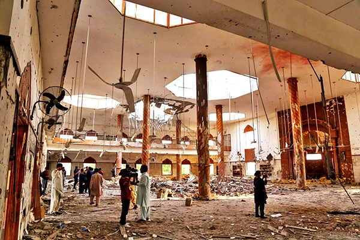

# Op Sindoor

- **Category:** OSINT
- **Difficulty:** medium · **Points:** 200
- **Flag:** `trace{Markaz_Subhan_Allah_Bahawalpur_2025-05-07}`

> **Note on sources.** India and Pakistan give conflicting accounts of what
> this
> operation destroyed and whom it killed. This challenge deliberately rests
> only
> on what both states state: that this site was struck, on this date. Disputed
> claims belong in the post-solve notes, with sources from both sides.

## The scenario

One photograph, taken from inside a wrecked hall. The roof is torn open in
several places with daylight coming through, the pillars are still standing,
ceiling fans hang shattered over a floor covered in rubble, and a dozen people
with cameras are picking their way across it.

Name the site, the city it sits outside, and the date it was struck.



## Step 1: Read what kind of photograph this is

Before searching, notice what the frame says about its own origin.

The people in it are not survivors or rescuers. They are carrying broadcast
cameras and DSLRs, standing in the open, photographing the ceiling. That is a
**guided media visit**, someone decided to let press in and document the damage.
Which means two things:

1. The photograph was **published**, with a caption, by an outlet or an agency.
2. It was probably published by **several**, because pool coverage syndicates.

A photograph that was made to be published is a photograph reverse image search
can find. That reframes the challenge: this is not a geolocation puzzle, it is a
provenance puzzle.

## Step 2: Date the event

The first hint (*May 2025, that narrows it to one week*) anchors the search
window without naming the operation.

**Operation Sindoor**, 7 May 2025. Indian strikes on nine sites, four in
Pakistan, five in Pakistan-administered Jammu and Kashmir, following the
Pahalgam attack of 22 April 2025, in which 26 civilians were killed. India
stated the strikes ran between 01:05 and 01:30 IST and did not engage Pakistani
military infrastructure.

The date field is settled by this step alone: **all nine sites were struck on
the same night**, so `2025-05-07` is correct before the site is even identified.

## Step 3: Reverse image search, then read the caption

The second hint says it plainly: *somebody published this photograph with a
caption.* Google Lens, Yandex, TinEye and Bing Visual Search, a syndicated wire
photo should resolve on at least one, and the caption carries the site and city
directly.

The third hint narrows the field for anyone whose reverse search comes up empty
and who has to reason it out instead. Nine sites were struck; only four were in
Pakistan proper:

| Site | City / district | Group |
| ---- | --------------- | ----- |
| **Markaz Subhan Allah** | **Bahawalpur** (near Ahmedpur East) | **JeM** |
| Markaz Taiba | Muridke | LeT |
| Sarjal / Tehra Kalan | Shakargarh, Sialkot | JeM |
| Mehmoona Joya | Kotli Loharan West, Sialkot | HuM |

The five in Pakistan-administered Kashmir, Barnala, two in Kotli, two in
Muzaffarabad, sit in hill terrain and are smaller structures. A hall of this
span, with this pillar spacing and this many fans, belongs to one of the large
Punjab campuses, and the two Sialkot entries are small compounds rather than
seminaries.

## Step 4: The answer

```text
Site:  Markaz Subhan Allah
City:  Bahawalpur, Punjab province, Pakistan
Date:  7 May 2025
```

The facility functioned as the primary religious seminary and headquarters of
**Jaish-e-Mohammed**, a UN-designated terrorist organisation, before being
struck. What the photograph shows is the main hall afterwards: collapsed
roofing, structural breaches from missile impacts, shattered ceiling fans, and
debris across the floor, with press documenting it.

Corroborate against a second independent outlet before submitting. Early
reporting on this operation varied, and the narrow claim this challenge rests on
is the part both governments state.

## The trap that will actually cost solves

It is not the search. It is the spelling.

| Form | Source |
| ---- | ------ |
| **Markaz Subhan Allah** | Indian MoD briefings, damage assessments, most press |
| Subhan Allah Mosque | **Wikipedia's Operation Sindoor article** |
| Masjid Subhan Allah | some regional coverage |

Wikipedia is the most likely first stop for anyone framing this event, and it
gives a different name from every damage assessment. A player who identifies the
site correctly and takes the name from the encyclopaedia submits a fully-solved
answer that fails.

The flag can only be one string, so the description resolves it by naming the
source class: *use the site name as the open-source damage assessments and the
official briefings write it, not the form used in encyclopaedia article titles.*
The disambiguation and the intended path point the same way, the same property
that makes the transliteration in "Meeting" safe.

The city is safe from this: every route, Wikipedia included, says Bahawalpur.

## Why this challenge works

The instinct with a damage photograph is to geolocate it: match the
architecture, find the building, pin the roof. That path is nearly impossible
here: the frame is interior, there is no skyline, no signage, and no window onto
anything identifiable.

The solvable path runs the other way, through the photograph's own provenance.
Someone was *allowed* in with a camera, which means the image was made to
circulate, which means it is indexed and captioned somewhere. Recognising that a
picture is a **published** picture, and that its publication history is
evidence, is a different reflex from geolocation, and it is the one this
challenge trains.

## Flag

```text
trace{Markaz_Subhan_Allah_Bahawalpur_2025-05-07}
```
