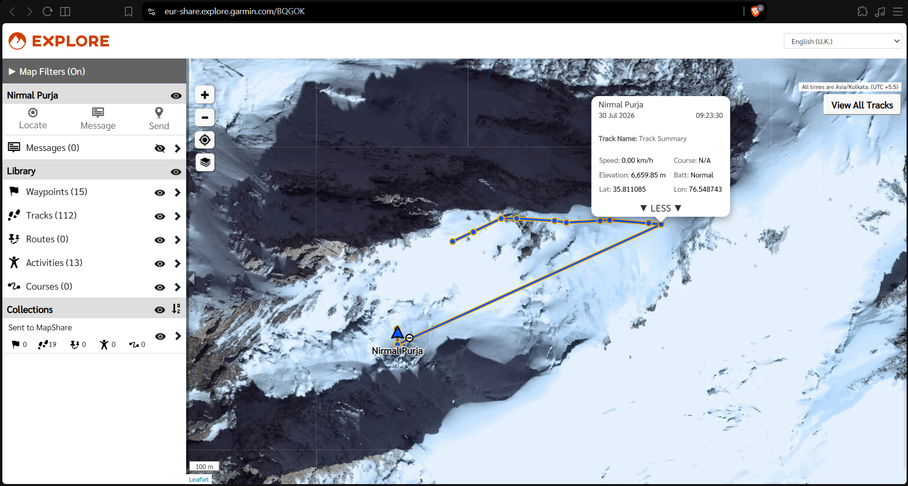

# Tribute to "The Legend"

- **Category:** OSINT
- **Difficulty:** easy · **Points:** 100
- **Flag:** `trace{6659.85,35.811085,76.548743}`

## The scenario

No image, no file, no download. Just a biography that stops mid-sentence: the
Gurkhas, the Special Boat Service, fourteen 8,000-metre summits in six months
and he was going round for a third time.

Identify him, then give the highest altitude he reached and where he was
standing when he reached it.

## Step 1: The biography is the artifact

There is nothing to reverse-image search, and that is the point. A prose
description can be as uniquely identifying as a photograph when the facts in it
are rare enough, and these are:

| Fact given                                              | How rare            |
| ------------------------------------------------------- | ------------------- |
| Brigade of Gurkhas                                      | thousands of people |
| First Gurkha selected into the **Special Boat Service** | exactly one         |
| All fourteen 8,000 m peaks in **six months**            | exactly one         |
| Attempting the whole set a **third** time               | a very short list   |

Any single line after the first resolves on the first page of a plain web
search. *"First Gurkha Special Boat Service"* and *"all 14 eight-thousanders in
six months"* each land directly on the man. The first hint points at the record
because it is the most distinctive of the four and the most likely to be a named
project.

He is **Nirmal "Nimsdai" Purja**, MBE. Brigade of Gurkhas 2003 to 2009; the
first Gurkha selected into the **Special Boat Service**, 2009 to 2018; MBE in
2018. In 2019 he climbed all fourteen eight-thousanders in **6 months and 6
days** *Project Possible 14/7*, a record that stood until 2023, and the subject
of the Netflix documentary *14 Peaks*. He founded the expedition operator
**Elite Exped**.

The lesson worth keeping from this step: identification does not require an
image. It requires a fact that only one person satisfies.

## Step 2: "Going round for a third time"

That clause dates the photograph's context. Announced in 2025, the **Hat-Trick
Challenge** was an attempt on the 14 eight-thousanders and the Seven Summits for
a **third** time, which is what the second hint names. Knowing the project
converts a famous name into a specific season, and a season into a peak list and
a set of public expedition dispatches.
## Step 3: Karakoram, not Himalaya

The third hint is the one that saves the most time. The instinct with this
climber is Nepal Everest, Annapurna, the Khumbu. The 2026 summer objectives were
in the **Karakoram**, in Gilgit-Baltistan, Pakistan.

Following the expedition's own dispatches forward to their last update lands on
**Broad Peak** 8,051 m, twelfth-highest mountain in the world, about eight
kilometres from K2, with a summit ridge over two kilometres long that gives the
mountain its name.

## Step 4: The telemetry

The first three steps get you a mountain. The flag wants something much more
specific: a high point, and a position, at a precision no article carries.

Note what the precision implies about the source. Six decimal places of latitude
is about ten centimetres on the ground; two decimal places of elevation is a
centimetre. Numbers of that shape do not come from journalism or from a
gazetteer. They come from a **recording device**, a watch, a satellite
communicator, a tracker, and from a file that somebody published.

That is the real lesson of the last step, and it generalises well beyond this
challenge: when the answer is more precise than any article could be, stop
reading articles. Go looking for the file.

Here the file is a **Garmin MapShare** page. Elite Exped's expeditions carry
inReach satellite communicators, and MapShare is the public page an inReach
account publishes its track to. His is:

```text
https://eur-share.explore.garmin.com/BQGOK
```



The popup on the last track point of 30 July reads the three values straight
off:

```text
Elevation:  6,659.85 m
Lat:        35.811085
Lon:        76.548743
```

Read the timestamp carefully. The page renders **09:23:30 on 30 Jul 2026** and
labels the map *All times are Asia/Kolkata (UTC +5.5)* the same fix is
`2026-07-30T03:53:30Z` in UTC. Nothing in the flag depends on the timezone, but
everything about matching this point to a news report does.

### Corroboration: the map popup against the raw record

The popup is a rendering, not the source. The feed record behind it (see below
for how to pull it) agrees on every field:

| Field | Map popup | Feed record |
| ----- | --------- | ----------- |
| Name | Nirmal Purja | `Nirmal Purja` |
| Timestamp | 30 Jul 2026 09:23:30 (IST) | `7/30/2026 3:53:30 AM` UTC |
| Elevation | 6,659.85 m | `6659.85 m from MSL` |
| Latitude | 35.811085 | `35.811085` |
| Longitude | 76.548743 | `76.548743` |
| Speed | 0.00 km/h | `0.0 km/h` |
| Course | N/A | `0.00 ° True` |
| n/a | n/a | `Valid GPS Fix: True`, `In Emergency: False` |
| n/a | n/a | Device: `inReach Mini 3 Plus` |

Two details are worth taking away. The UI renders a course of exactly zero as
**N/A**, so a value that looks absent on the map is present in the data never
conclude a field is empty from the popup alone. And the record carries `Valid
GPS Fix: True`, which is the difference between a measured position and an
interpolated one; at six decimal places that distinction is the whole basis for
trusting the number.

That point is on Broad Peak's **western flank**, roughly 1.5 km west of the
summit, the ground the normal route crosses between Camp 2 and Camp 3.

### Working the feed instead of the map

Clicking track points in the web UI is fine for one value and miserable for a
whole season. MapShare also serves the raw KML, and the same identifier works:

```bash
curl -s "https://eur-share.explore.garmin.com/Feed/Share/BQGOK" -o track.kml
```

That returns **483 track points**, each an `ExtendedData` block carrying
`Elevation`, `Latitude`, `Longitude`, `Time UTC`, velocity, course and battery.
The device identifies itself as an **inReach Mini 3 Plus**. Without a date range
the feed hands back only the most recent fix, which is the single most common
way to look at this page and conclude it holds nothing.

Two things are worth knowing about the feed. It is **unauthenticated** the
five-character MapShare identifier is the whole of the access control and the
date window is a mandatory part of any historical query. Both are properties of
the platform, not of this account.

## Why 6,659.85 m: the track alone proves it

The flag is not "some point on the last day". It is the **terminus of the final
ascent**, and the track identifies it as such without needing a single outside
source. Three facts do the work.

**1. The day starts from a camp.** 29 July's last fix is `6166.46 m` at
08:08:15Z, and its event field reads **`Tracking turned off from device`**, a
deliberate shutdown, not a signal loss. 30 July's first fix is the *same
elevation*, `6166.46 m`, **7 metres away**. Tracking off overnight, resumed in
the small hours: that is a camp and a pre-dawn start.

**2. What follows is ten consecutive fixes, every one a gain.**

| Time (UTC) | Elevation | Gain |
| ---------- | --------- | ---- |
| 00:33:30 | 6166.46 m | n/a |
| 00:43:30 | 6207.01 m | +40.55 |
| 01:13:30 | 6293.18 m | +86.17 |
| 01:23:30 | 6329.70 m | +36.52 |
| 02:03:30 | 6430.82 m | +101.12 |
| 02:13:30 | 6458.58 m | +27.76 |
| 02:43:30 | 6533.00 m | +74.42 |
| 02:53:30 | 6565.73 m | +32.73 |
| 03:43:30 | 6645.68 m | +79.95 |
| **03:53:30** | **6659.85 m** | **+14.17** |

`+493.39 m` over 3 h 20 min, **+148 m/h**, at a ground speed of 0.21 km/h. That
is textbook high-altitude climbing pace. The horizontal track runs **683 m on
bearing 085°**, and Broad Peak's summit lies **1,467 m away on bearing 087°**.
He is walking straight at it.

**3. The ascent ends at 03:53:30, and nothing resumes it.** The next fix, thirty
minutes later:

| | High point 03:53:30 | Next fix 04:23:30 | Δ |
| --- | --- | --- | --- |
| Elevation | 6659.85 m | 5935.52 m | **−724.33 m** |
| Position | 35.811085, 76.548743 | 35.807555, 76.539195 | **946 m, bearing 245°** |

−724 m in half an hour is **−1,449 m/h**, near ten times the ascent rate, in the
opposite direction, and bearing 245° reverses the 085° he had been climbing on.
Nobody downclimbs that. It is displacement, not travel.

Everything after it is a device at rest. From 04:23:30 to the final fix twenty
hours later the position moves **39 m**, a ground speed of 0.00 km/h.

So the shape of the track is unambiguous: **one continuous climb, a single
catastrophic displacement, then stillness.** The last point of the climb is the
highest he got, it is uniquely identified, and `6659.85 / 35.811085 / 76.548743`
is that point. A solver who plots the day and asks "where does the ascent stop?"
lands on it without knowing anything about what happened there.

## Corrected in this archive: which maximum the question asks for

To be clear about what is and is not wrong here: **the flag value is sound.**
The section above establishes it from the track geometry alone, and it is the
only defensible reading of "where he got to". The defect was entirely in the
wording of the question, which pointed at a different number than the one it
accepts.

As run at the event, the description asked for *"the highest altitude he
reached"*. Taken literally against the artifact, that is **not** `6659.85`.
Reducing the 483 feed points to a maximum per day:

| Date | Max elevation | Position | Where |
| ---- | ------------- | -------- | ----- |
| 2026-06-04 | **8462.43 m** | 27.890178, 87.089803 | Makalu, Nepal |
| 2026-07-21 | 8030.89 m | 35.757945, 76.653306 | Broad Peak, summit push |
| 2026-07-22 | 6918.42 m | 35.748278, 76.645475 | Broad Peak, descending |
| 2026-07-29 | 6166.46 m | 35.810633, 76.541168 | west flank |
| **2026-07-30** | **6659.85 m** | **35.811085, 76.548743** | **← the flag** |
| 2026-07-31 | 5878.67 m | 35.807908, 76.539195 | last fix on the feed |

The feed's true maximum is **8,462.43 m on Makalu, 4 June 2026**, a different
mountain, a different range, seven weeks earlier. A player who reads the
description literally, sorts the track by elevation and takes the top row
submits `trace{8462.43,27.890178,87.089803}` and is marked wrong.

The flag is the maximum of **30 July alone**, the high point of the final climb.

It gets worse on inspection: `8462.43 m` appears at **two different
coordinates** ten minutes apart (05:27:15 and 05:37:15 UTC), so even the literal
reading has no unique position to submit. Only the per-day reading resolves to
one point.

**The wording is corrected in this archive.** The README now asks for *the
highest altitude he reached on his final climb*. That is a one-clause change, it
leaves the flag untouched, and it makes the artifact answer the question that is
actually asked. Teams who played the live event saw the older wording, so any
scoreboard dispute from the day should be read against the paragraph above
rather than against the text shipped here.

## Format matters more here than anywhere else

At this precision the flag is unforgiving, and there is no tolerance matching
one exact string. The description therefore pins every degree of freedom:

| Rule | Right | Wrong |
| ---- | ----- | ----- |
| Elevation, 2 dp, no thousands separator | `6659.85` | `6,659.85`, `6659.8`, `6660` |
| Lat/lon, 6 dp | `35.811085` | `35.81108`, `35.8111` |
| Order | elevation, lat, lon | any other |
| Separator | comma, no spaces | `, ` or `_` |

None of the three values ends in a zero, so at least there is no trailing-zero
trap of the kind that eats coordinate submissions elsewhere in this set.
## Flag

```text
trace{6659.85,35.811085,76.548743}
```
